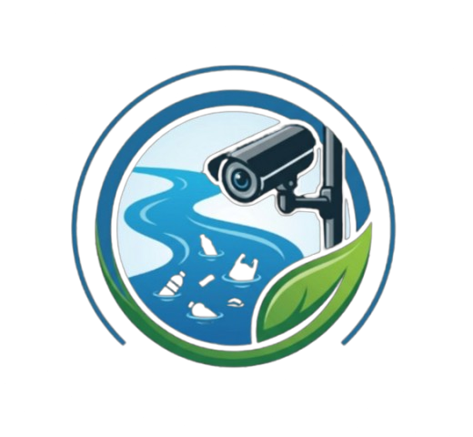

<div align="center">
  
  <h1>RiverEye AI 🌊</h1>
  <p><strong>Sistem Pemantauan Sampah Sungai Berbasis Computer Vision (YOLOv8)</strong></p>
  
  [](https://fastapi.tiangolo.com/)
  [](https://reactjs.org/)
  [](https://github.com/ultralytics/ultralytics)
  [](https://vitejs.dev/)
</div>

<br />

**RiverEye AI** adalah sebuah aplikasi cerdas untuk mendeteksi sampah pada permukaan air (sungai, danau, kanal) secara otomatis menggunakan teknologi Computer Vision. Dibangun dengan backend asinkron berperforma tinggi dan antarmuka web modern yang dinamis.

---

## 🎯 Fitur Utama

- 🎥 **Pemrosesan Video Latar Belakang (Asynchronous)**
  Upload video dan biarkan AI bekerja di latar belakang tanpa mengganggu interaksi UI.
- ⚡ **Deteksi Sampah (Waste Surface) Real-time**
  Diperkuat oleh model `yolov8s.pt` untuk deteksi objek sampah di permukaan air dengan tingkat akurasi dan kecepatan yang optimal.
- 📡 **WebSockets Live Preview**
  Pantau progres analisis frame-by-frame dan lihat bounding box secara langsung di dashboard.
- 🗑️ **Deduplikasi Cerdas**
  Mencegah spam event dengan menyatukan deteksi objek yang sama dalam rentang waktu yang berdekatan.
- 📊 **Pelaporan Terstruktur**
  Setiap analisis menghasilkan laporan mendetail yang mencakup screenshot teranotasi, waktu kejadian (*timestamp* video), dan tingkat keyakinan (*confidence*).

---

## 🏗️ Arsitektur Teknologi

**Frontend:**
- **React 18** (Vite)
- **React Router** untuk navigasi halaman SPA.
- Antarmuka khusus dengan styling CSS modern (Glassmorphism, Dark mode).
- Ikon dari **Lucide React**.

**Backend:**
- **FastAPI** untuk API server asinkron dan pengelolaan WebSockets.
- **Ultralytics YOLOv8** untuk pemrosesan Computer Vision (Vision Engine).
- **OpenCV & Pillow (PIL)** untuk manipulasi gambar dan penambahan anotasi visual.
- **SQLAlchemy & SQLite** untuk manajemen basis data sesi analisis dan log kejadian.

---

## 🚀 Panduan Instalasi (Local Development)

Ikuti langkah-langkah di bawah ini untuk menjalankan **RiverEye AI** di mesin lokal Anda.

### Persyaratan Sistem
* Python 3.10 atau lebih baru.
* Node.js 18 atau lebih baru.
* (Opsional namun disarankan) GPU yang didukung CUDA/MPS untuk mempercepat inferensi AI.

### 1. Menyiapkan Backend (FastAPI + YOLO)

1. Buka terminal dan arahkan ke folder proyek.
2. Buat Virtual Environment untuk Python:
   ```bash
   python3 -m venv .venv
   source .venv/bin/activate  # Untuk Linux / Mac
   # atau: .venv\Scripts\activate untuk Windows
   ```
3. Install semua *dependencies* Python:
   ```bash
   cd backend
   pip install -r requirements.txt
   ```
4. **Catatan**: Model AI YOLO (`yolov8s.pt`) sudah disertakan di repositori ini, sehingga Anda tidak perlu repot mengunduhnya secara manual.

5. Jalankan server backend:
   ```bash
   uvicorn backend.main:app --reload --host 0.0.0.0 --port 8000
   ```
   *Atau gunakan script `bash run_backend.sh` jika berada di Linux/CachyOS.*

### 2. Menyiapkan Frontend (React + Vite)

1. Buka terminal baru dan biarkan backend tetap berjalan.
2. Masuk ke direktori frontend:
   ```bash
   cd frontend
   ```
3. Install paket npm:
   ```bash
   npm install
   ```
4. Jalankan server pengembangan Vite:
   ```bash
   npm run dev
   ```
   *Atau gunakan script `bash run_frontend.sh` jika berada di Linux/CachyOS.*

5. Buka tautan lokal yang diberikan oleh Vite (biasanya `http://localhost:5173`) di browser Anda!

---

## 📂 Struktur Direktori Utama

```text
RiverEye/
├── backend/
│   ├── main.py                # Entry point aplikasi FastAPI
│   ├── database.py            # Konfigurasi SQLite SQLAlchemy
│   ├── models/                # Schema database (Session, Event)
│   ├── routers/               # API endpoint (Upload, Events, dll)
│   └── services/
│       ├── vision_engine.py   # Logika inti pemrosesan YOLOv8 (OpenCV & Inferensi)
│       └── websocket_manager.py # Pengelola siaran data Real-time
├── frontend/
│   ├── index.html             # Entry point HTML web app
│   ├── public/                # Aset statis (Favicon / Logo)
│   └── src/
│       ├── api/               # Konfigurasi klien Axios
│       ├── components/        # Komponen re-usable React (Sidebar, Modal, dll)
│       ├── pages/             # Halaman utama aplikasi
│       └── index.css          # Desain dan variabel warna sistem
├── runs/                      # (Git-Ignored) Folder output default proses pelatihan AI
├── storage/                   # (Git-Ignored) Tempat menyimpan upload video dan hasil screenshot
├── yolov8s.pt                 # File bobot model YOLOv8
└── README.md                  # Dokumentasi proyek ini
```


---
<div align="center">
  <sub>Dikembangkan untuk IYREF 2026.</sub>
</div>
